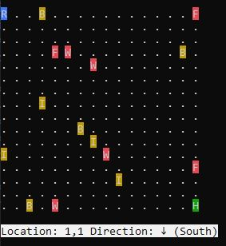

## Proje Hakkında

Tavşan “Yıldız" ormanda kaybolmuş ve ailesinden uzak yaşamaktadır. Amacımız yıldızı ormandaki tavşan deliğine sokmaktır. Orman içerisinde maksimum 4 farklı cinste ve adet olarak maksimum 4 er engel olabilir. 

Detaylı bilgilere aşağıdaki adres yolundan belirtilen pdf dosyasından ulaşabilirsiniz.

```
asset/Assessment.pdf
```

<h3><b>Çalışma Görüntüsü</b></h2>

<p align="center">
  
</p>

<h3><b>Projede Kullanılan Teknoloji</b></h2>
<ul>
	<li>.NET Framework 4.6.2</li>
	<li>Console Application</li>
</ul>

<h3><b>Proje Tanımları</b></h2>

<br>

1.) Ormandaki nesneler için aşağıdaki şekilde kısa kod verilmiştir.

```
Tavşan = 'R', Mavi Renk
Kurt = 'W', Kırmızı Renk
Tilki = 'F', Kırmızı Renk
Dikenli Tel = 'B', Sarı Renk
Tel Çit = 'I', Sarı Renk
Tavşan Deliği = 'H' Yeşil Renk
```

2.) Hareket etmek için aşağıdaki komutları kullanmanız gerekmektedir.

```
İleri = N
Geri = P
Sağ = R 
Sol = L
Zıpla = J
Eğil = I
```

<h3><b>Proje Çalıştırılması</b></h2>

<br>

1.) Proje çalıştırıldıktan sonra öncelikle ormanın büyüklüğü girilecektir Bu büyüklük 4,8,16 olabilir.

2.) Daha sonra oluşan tahta üzerinde senaryo veya tek tek komut verilecektir. Örnek senaryo aşağıdaki gibidir.

```
N,N,L,J,N,N,I,P,J
```
3.) Senaryo başarılı bir şekilde çalışırsa tavşan deliğe girmesi beklenecektir. Yoksa tekrardan başlatılması gerekmektedir.